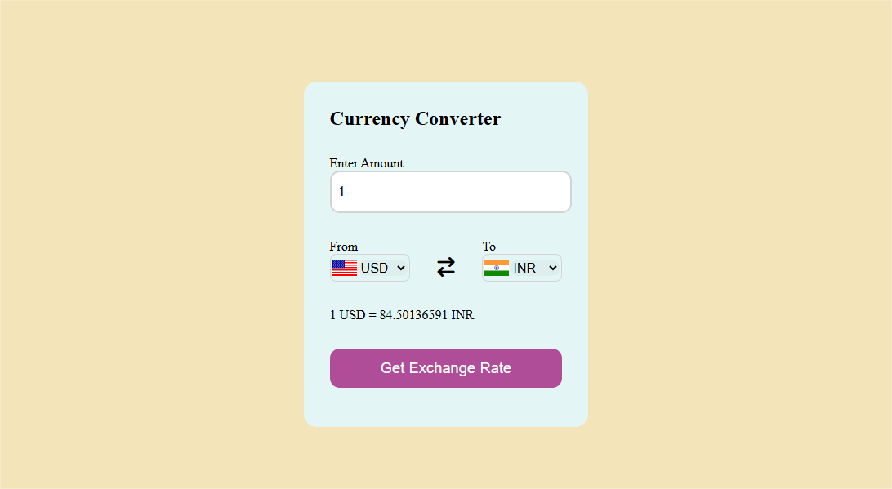

# Currency Converter

A simple and visually appealing **Currency Converter** application built using HTML, CSS, and JavaScript. It allows users to calculate currency conversion rates dynamically, offering a user-friendly experience with an intuitive interface.

## Features
- **Dynamic Currency Conversion**: Convert amounts between different currencies.
- **Real-Time Exchange Rates**: Fetches up-to-date currency exchange rates via an API.
- **Responsive Design**: Optimized for desktops and mobile devices.
- **Country Flags**: Displays flags of the selected currencies.
- **Pre-filled Defaults**: Defaults to USD to INR conversion for ease of use.

## Technologies Used
- **HTML**: For structuring the content.
- **CSS**: For styling and creating a visually engaging design.
- **JavaScript**: For fetching live exchange rates and interactivity.

## Project Structure
- `index.html`: The main HTML file that structures the app.
- `style.css`: Contains the styling rules for the layout, colors, and design.
- `App.js` & `codes.js`: JavaScript files for managing the logic and API integration.

## How to Run the Project
1. Clone the repository:
   ```bash
   git clone https://github.com/Abhishek99M/Currency_Converter.git
   ```
2. Navigate to the project directory:
   ```bash
   cd Currency_Converter
   ```
3. Open the `index.html` file in any modern browser:
   ```bash
   open index.html
   ```

## Future Enhancements
- Add support for historical exchange rates.
- Implement a search bar for quickly finding currencies.
- Enhance design with animations or additional visuals.

## Screenshots


